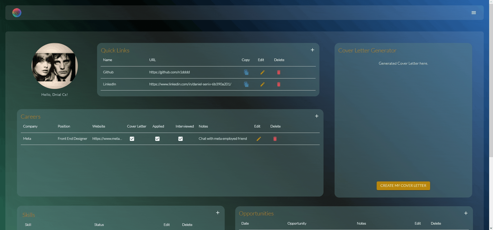

## Pulse App
A full stack web application that allows users to keep track of and organize data relevant to a job hunt. Users data on job hunting, important links, skill tracking, networking can be compartmentalized into indivual components, painting a story of a users journey of finding employment, and gaining new skills along the way. The user can also generate a cover letter using their submitted data, providing a smooth flow in respect to their job search.

## Final Product
### Home Page and Login

### Landing Page and About Page

### User Story -- Using the App

### The Cover Letter Generator

## Getting Started
From the root folder containing client and server
Run `cd client && npm i` to install front-end dependencies
Run `cd server && npm i` to install back-end dependencies

Run `npm run start` to run the front-end client

visit http://localhost:3000/

Run `npm run local` to run the server

Visit http://localhost:8080/

## Dependencies
Front End
`
"@auth0/auth0-react": "^2.1.0",
"@emotion/react": "^11.11.0",
"@emotion/styled": "^11.11.0",
"@mui/icons-material": "^5.11.16",
"@mui/material": "^5.13.4",
"@mui/x-data-grid": "^6.6.0",
"@testing-library/jest-dom": "^5.16.5",
"@testing-library/react": "^13.4.0",
"@testing-library/user-event": "^13.5.0",
"axios": "^1.4.0",
"date-fns": "^2.30.0",
"moment": "^2.29.4",
"react": "^18.2.0",
"react-dom": "^18.2.0",
"react-router": "^6.12.0",
"react-router-dom": "^6.12.0",
"react-scripts": "5.0.1",
"react-spinners": "^0.13.8",
"web-vitals": "^2.1.4"
`

Back End

`
"body-parser": "^1.20.2",
"cors": "^2.8.5",
"dotenv": "^16.1.4",
"express": "^4.18.2",
"fs": "^0.0.1-security",
"morgan": "^1.10.0",
"nodemon": "^2.0.22",
"openai": "^3.2.1",
"pg": "^8.11.0"
`

Stack used = PERN (Postgres Express React Node)

## Loading Database table and seeding files in server

1. on terminal run command `psql`
2. run commands:
   - `SET ROLE labber`
   - `CREATE DATABASE final`
3. .env file config
   - `DB_HOST=localhost`
   - `DB_USER=labber`
   - `DB_PASS=labber`
   - `DB_NAME=final`
   - `DB_PORT=5432`
4. On your local terminal in pulse-app, `cd server`
5. Run command `npm run db:reset` -> this should create tables and seed files
